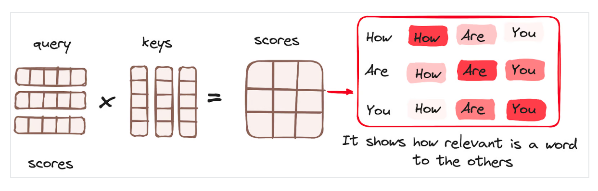
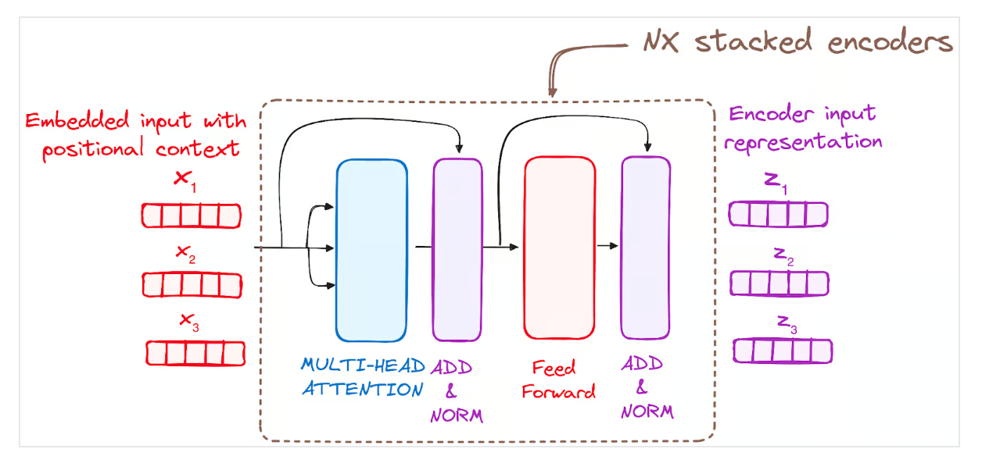

# Introduction to Transformers from Scratch
## project-overview

Hey there! Welcome to this project where I'm building a Transformer model from scratch using PyTorch. My goal is to understand every single component of a Transformer, from how it processes words to how it focuses on important information and generates output. I'll explain each part in depth, as simply as possible. This project is all about deepening my knowledge of how Transformers work and how we can use them for various tasks

---

## 📋 Table of Contents

1. [Project Overview](#project-overview)  
2. [What Are Transformers?](#what-are-transformers)  
3. [Project Goals](#project-goals)  
4. [High-Level Architecture](#high-level-architecture)  
5. [Core Components](#core-components)  
   - [Input Embeddings](#input-embeddings)  
   - [Positional Encodings](#positional-encodings)  
   - [Layer Normalization & Residuals](#layer-normalization--residuals)  
   - [Feed-Forward Network](#feed-forward-network)  
   - [Multi-Head Attention](#multi-head-attention)  
   - [Cross-Attention (Decoder)](#cross-attention-decoder)  
   - [Projection Layer](#projection-layer)  
6. [Putting It All Together](#putting-it-all-together)  
7. [Folder Structure](#folder-structure)  
8. [Author & Contact](#author--contact)  


---
## what-are-transformers

**Technical Definition:**  
A Transformer is a sequence‑to‑sequence neural network architecture relying entirely on self‑attention mechanisms rather than recurrent or convolutional layers. It consists of stacked encoder and decoder blocks, each with multi‑head self‑attention, residual connections, layer normalization, and position‑wise feed‑forward networks.

**In Plain English:**  
Imagine you have a machine that can read a sentence in one language and write it in another. That's essentially what a Transformer does! It's a special kind of AI that learns to understand the meaning of a sentence by looking at how all the words relate to each other, not just one by one. Once it understands, it can then create new text, like a translation, that makes sense.

A transformer is a type of artificial intelligence model that learns to understand and generate human-like text by analyzing patterns in large amounts of text data.


---
## project-goals

In this project, I'm aiming to use the Transformer model for Neural Machine Translation (NMT). Specifically, I'll be writing the code from scratch, focusing on the core Transformer blocks, and training the model to translate English to Telugu. 
I'll save the trained model after each training "epoch" (a full pass through the training data). also the main thing is explaining each level neatly step by step with diagrams and code


---
## high-level-architecture

Think of the Transformer as a “black box” for translation:

Don't let the complex diagrams scare you! At its heart, a Transformer has a basic structure: an Encoder block and a Decoder block.


1. **Encoder** transforms input tokens into context‑rich vectors.  
2. **Decoder** takes those vectors and produces the translated output, one token at a time.
## decoder
```

class Decoder(nn.Module):
    def __init__(self , layers):
        super().__init__()
        self.layers = layers 
        self.norm = LayerNormalization(1e-6)

    def forward (self , x, encoder_output , src_mask , trgt_mask ):
        for layer in self.layers:
            x = layer(x, encoder_output , src_mask , trgt_mask)
        return self.norm(x)

```
## encoder 
```
class Encoder(nn.Module):
    def __init__(self , layers ):
        super().__init__()
        self.layers = layers
        self.norm = LayerNormalization()

    def forward (self ,x ,mask):
        for layer in self.layers:
            x = layer(x,mask)

        return self.norm(x)
```

---
## General structure of Transfomers 

Now, let's add a bit more complexity. The Encoder and Decoder aren't just single blocks; they are actually stacks of multiple identical layers.

Both the Encoder and Decoder are composed of N identical layers. Each encoder layer processes the input sequentially before passing its output to the next layer in the stack. Similarly, each decoder layer receives input from the final encoder layer (for cross-attention) and from the previous decoder layer. The original Transformer architecture used 6 encoder and 6 decoder layers, but this number (N) is flexible and can be adjusted.


```
    # Create the encoder blocks
    encoder_blocks = []
    for _ in range(N):
        encoder_self_attention_block = MultiHeadAttention(d_model, h, dropout)
        feed_forward_block = FeedForwardBlock(d_model, d_ff, dropout)
        encoder_block = EncoderBlock(encoder_self_attention_block, feed_forward_block, dropout)
        encoder_blocks.append(encoder_block)

    # Create the decoder blocks
    decoder_blocks = []
    for _ in range(N):
        decoder_self_attention_block = MultiHeadAttention(d_model, h, dropout)
        decoder_cross_attention_block = MultiHeadAttention(d_model, h, dropout)
        feed_forward_block = FeedForwardBlock(d_model, d_ff, dropout)
        decoder_block = DecoderBlock(
            decoder_self_attention_block,
            decoder_cross_attention_block,
            feed_forward_block,
            dropout
        )
        decoder_blocks.append(decoder_block)
```

---
## core-components

Let's zoom in on a single Encoder Block. This is what we'll be coding piece by piece. An input first becomes "embeddings" (numerical representations) and "positional embeddings" (information about word order), then goes through several crucial steps.

The encoder's primary function is to transform input tokens into contextualized representations. Unlike older models that processed tokens in isolation, the Transformer encoder captures the meaning of each token in relation to its entire sequence. Its structure consists of:

1) Self-Attention: Allows the encoder to weigh the importance of different words in the input sequence when processing each word.

2) Add & Normalize (Residual Connection and Layer Normalization): Combines the output of a sub-layer with its input (a residual connection) to help deep models train more effectively by mitigating the vanishing gradient problem. This is followed by Layer Normalization to stabilize the network's activations.

3) Feed-Forward Network: A simple neural network applied independently to each position, adding non-linearity and further transforming the representations.


---
### input-embeddings

Before we even get to the Encoder block, we need to prepare our text input.


The first step is to convert input tokens (words or subwords) into numerical vectors using embedding layers. These embeddings capture the semantic meaning of the tokens. 
This process occurs only in the bottom-most encoder. All encoders receive fixed-size vectors (e.g., 512 dimensions). For the first encoder, these are the word embeddings; for subsequent encoders, they are the outputs of the encoder directly below.
We multiply by sqrt(d_model) for scaling, which helps stabilize training. vocab_size refers to the total number of unique words or subwords identified in the source language.
```
class InputEmbeddings(nn.Module):
    def __init__(self, d_model, vocab_size):
        super().__init__()
        self.d_model= d_model
        self.vocab_size = vocab_size
        self.embedding = nn.Embedding(vocab_size, d_model)

    def forward(self, x):
        return self.embedding(x) * math.sqrt(self.d_model)
```
We multiply by sqrt(d_model) for scaling, which helps stabilize training. vocab_size refers to the total number of unique words or subwords identified in the source language.


---
### positional-encodings
Since Transformers process all words at once (unlike older models that read word by word), we need a way to tell the model the order of words.

Transformers lack a recurrence mechanism (like RNNs) to inherently understand sequence order. Therefore, positional encodings are added to the input embeddings. These encodings provide information about the absolute and relative position of each token in the sequence. They are generated using a combination of sine and cosine functions of varying frequencies, allowing them to scale to sentences of any length. Each dimension of the positional encoding uses a unique frequency and offset, with values typically ranging from -1 to 1.


Let's take an example sentence and calculate its positional encoding. Generally, even-indexed dimensions get a sine function, and odd-indexed dimensions get a cosine function based on the formula: PE(pos,2i)=sin(pos/10000^(2i/d_model)) and  PE(pos,2i+1)=cos(pos/10000^(2i/d_model)).


```
class PositionalEncoding(nn.Module):
    def __init__(self , d_model, seq_len, dropout):
        super().__init__()
        self.d_model = d_model
        self.seq_len = seq_len
        self.dropout = nn.Dropout(dropout)

        pe = torch.zeros(seq_len, d_model)
        position = torch.arange(0, seq_len, dtype=torch.float).unsqueeze(1)
        div_term  = torch.exp(torch.arange(0,d_model,2).float() *(-math.log(10000)/d_model))

        pe[:,0::2] = torch.sin(position*div_term )
        pe[:,1::2] = torch.cos(position*div_term )

        pe = pe.unsqueeze(0)
        self.register_buffer('pe', pe)
        
    def forward(self,x):
        x = x + (self.pe[:,:x.shape[1],:])
        return self.dropout(x)

```
Here, pe dimensions are (seq_len, d_model), but our input x will be (batch_size, seq_len, d_model). That's why we use unsqueeze(0) on pe to make it compatible for broadcasting. The pe matrix is pre-computed and sliced according to the actual sequence length of the input. We also register pe as a buffer so it's saved with the model and can be moved to different devices (like a GPU) correctly.

---
### layer-normalization--residuals
After each sub-layer (like self-attention or feed-forward), a normalization step is applied.

Each sub-layer in an encoder (and decoder) block is followed by a normalization step called Layer Normalization. Additionally, the output of each sub-layer is added to its input (a residual connection).

```
class Residual(nn.Module):
    def __init__(self , dropout):
        super().__init__()
        self.dropout = nn.Dropout(dropout)
        self.norm = LayerNormalization()

    def forward(self, x , sublayer):
        return x + self.dropout(sublayer(self.norm(x)))
```

This combined step helps to mitigate the vanishing gradient problem, which is crucial for training deeper neural networks effectively. This process is applied after both the self-attention and the feed-forward network within each block, ensuring stability and efficient information flow.

This is formula for the layer normalization 


This is the code for it 

```
    def __init__(self, epsilon = 1e-6 ):
        super().__init__()
        self.epsilon = epsilon
        self.alpha = nn.Parameter(torch.ones(1))
        self.beta =  nn.Parameter(torch.zeros(1))

    def forward(self, x):
        mean = x.mean(dim = -1 , keepdim = True)
        var = x.var(dim = -1 , keepdim = True)
        return (self.alpha * ((x-mean) / torch.sqrt(var + self.epsilon)))+self.beta
```

This is visualization of normalization 


this is where we use it in code 


---
### feed-forward-network

The normalized output (from the residual connection and layer normalization) then passes through a pointwise feed-forward network. This network consists of two linear layers with a ReLU activation function in between. It's applied independently to each position in the sequence After this, another residual connection and layer normalization step are applied. The input dimensions change from (batch_len,seq_len,d_model) to (batch_len,seq_len,d_ff) and back to (batch_len,seq_len,d_model), where d_ff is typically larger than d_model (e.g., 2048 vs. 512).


```
class FeedForwardBlock(nn.Module):
    def __init__(self , d_model , dff, dropout):
        super().__init__()
        self.dropout = nn.Dropout(dropout)
        self.linear_1 = nn.Linear(d_model, dff)
        self.linear_2 = nn.Linear(dff , d_model)
    def forward(self , x):
        return self.linear_2(self.dropout(torch.relu(self.linear_1(x))))
```


---

### multi-head-attention

Ho now we are now going to discuss the bad boy brace yourselves 

This is arguably the most crucial and innovative part of the Transformer.

The Multi-Head Attention mechanism allows the model to simultaneously focus on different parts of the input sequence (or different parts of the encoder output for the decoder) when processing each token.

Initially, the input sequence is linearly projected into three different learned representations: Query (Q), Key (K), and Value (V).


The initial transformation looks like this: (batch,seq_len,d_model) -> (batch,seq_len,d_model).

```
        query = self.w_q(q)
        key = self.w_k(k)
        value = self.w_v(v)
```
It computes attention scores based on three components:
Query: A vector that represents a token from the input sequence text.
Key: A vector corresponding to each word or token in the input sequence.
Value: Vectors that are associated with every key and are used to create the output of the attention layer. When a query and key have a high attention score, the corresponding value is emphasized in the output.

Instead of performing a single attention function, Q, K, and V are projected h times into different smaller "heads." Each of these projected versions of Q, K, and V then undergoes the attention mechanism in parallel. This results in h separate attention outputs.


The dimensions change from (batch,seq_len,d_model) -> (batch,seq_len, h , d_k), where  d_k=d_model/h.  We then transpose the dimensions to (batch ,h ,seq_len ,d_k) for parallel computation across heads.
```
        query = query.view(query.shape[0],query.shape[1],self.h,self.d_k).transpose(1,2)
        key = key.view(key.shape[0],key.shape[1],self.h,self.d_k).transpose(1,2)
        value = value.view(value.shape[0],value.shape[1],self.h,self.d_k).transpose(1,2)
        x , self.attention_scores =  MultiHeadAttention.attention(query , key ,value ,mask , self.dropout)
```

next we pass them through self attention here 

The attention scores are calculated by performing a dot product matrix multiplication between the Query and Key vectors. This results in a score matrix that indicates how much focus each word should place on every other word in the sequence. A higher score signifies greater relevance.



```
        attention_scores = (query @ key.transpose(-2,-1))/ math.sqrt(d_k)
```
  
The scores are then scaled down by dividing them by the square root of the dimension of the query and key vectors. This step is implemented to ensure more stable gradients, as the multiplication of values can lead to excessively large effects.


Masking is then applied, especially in the decoder (and for padding in the encoder), to prevent positions from attending to subsequent positions (in the decoder) or padding tokens. The mask sets certain attention scores to a very large negative number (like -1e9), so that when a softmax is applied, these positions effectively get a probability of zero.


let me show you a visualization of complete pipline inside the attention block 


```
 attention_scores = attention_scores.masked_fill(mask == 0, -1e9)
```
Subsequently, a softmax function is applied to the adjusted scores to obtain the attention weights. These weights are probability values (ranging from 0 to 1), where higher values indicate more attention. Softmax emphasizes higher scores and diminishes lower ones, helping the model pinpoint crucial words.


```
 attention_scores = attention_scores.softmax( dim = -1 )
```
next the multiplaction of the output fro the softmax with the vaue here to get the final output of the self attention with casual mask
The following step of the attention mechanism is that weights derived from the softmax function are multiplied by the value vector, resulting in an output vector.

In this process, only the words that present high softmax scores are preserved. Finally, this output vector is fed into a linear layer for further processing.

And we finally get the output of the Attention mechanism!

So, you might be wondering why it’s called Multi-Head Attention?

Remember that before all the process starts, we break our queries, keys and values h times. This process, known as self-attention, happens separately in each of these smaller stages or 'heads'. Each head works its magic independently, conjuring up an output vector.

This ensemble passes through a final linear layer, much like a filter that fine-tunes their collective performance. The beauty here lies in the diversity of learning across each head, enriching the encoder model with a robust and multifaceted understanding.


```
return (attention_scores @ value),attention_scores
```
and finally the conactanation of the h we have divided intially before the attention meachnism 
```
        x , self.attention_scores =  MultiHeadAttention.attention(query , key ,value ,mask , self.dropout)
        x = x.transpose(1, 2).contiguous().view(x.shape[0], -1, self.h *self.d_k)
```
The output of the final encoder layer is a set of vectors, each representing the input sequence with a rich contextual understanding. This output is then used as the input for the decoder in a Transformer model.

This careful encoding paves the way for the decoder, guiding it to pay attention to the right words in the input when it's time to decode.

Think of it like building a tower, where you can stack up N encoder layers. Each layer in this stack gets a chance to explore and learn different facets of attention, much like layers of knowledge. This not only diversifies the understanding but could significantly amplify the predictive capabilities of the transformer network.



```
class EncoderBlock(nn.Module):
    def __init__(self, self_attention_block , feed_forward_layer , dropout):
        super().__init__()
        self.attention_block = self_attention_block 
        self.feed_forward_layer = feed_forward_layer
        self.residual = nn.ModuleList(Residual(dropout) for _ in  range(2))
        
    def forward (self , x ,src_mask ):
        x = self.residual[0](x,lambda x :self.attention_block(x,x,x,src_mask))
        x = self.residual[1](x , self.feed_forward_layer)

```

---

### cross-attention-decoder

The Decoder Block is similar to the Encoder, but it has an additional "Cross-Attention" layer.

The Decoder Block also contains self-attention and feed-forward layers, followed by residual connections and layer normalization. 
However, it introduces a third sub-layer: Cross-Attention. This layer allows the decoder to attend to the output of the encoder (the context vector) in addition to its own output. 
This is crucial for tasks like machine translation, where the decoder needs to align its generated output with the information from the input sentence. 
The src_mask is used in cross-attention to mask padding tokens from the encoder output, while trgt_mask (a causal mask) is used in self-attention within the decoder to prevent it from looking at future tokens when generating the current one.


```
class DecoderBlock (nn.Module):
    def __init__(self , self_attention_block , cross_attention_block ,feed_forward_layer , dropout ):
        super().__init__()
        self.self_attention_block = self_attention_block
        self.feed_forward_layer = feed_forward_layer 
        self.cross_attention_block = cross_attention_block 
        self.residual = nn.ModuleList(Residual(dropout) for _ in range(3))

    def forward (self , x  ,encoder_output , src_mask , trgt_mask  ):
        x = self.residual[0](x, lambda x:self.self_attention_block(x , x, x , trgt_mask) )
        x = self.residual[1](x , lambda x : self.cross_attention_block(x,encoder_output ,encoder_output ,src_mask))
        x = self.residual[2](x , self.feed_forward_layer)

        return x
```
next let me show you the specific structure on how the cross attention works wrt to the above code here 


```
 x = self.residual[1](x , lambda x : self.cross_attention_block(x,encoder_output ,encoder_output ,src_mask))
```

---
### projection-layer

After the Decoder has processed the information and generated its final output, we need a way to convert this numerical representation back into actual words in the target language.
The output from the final Decoder layer is a high-dimensional vector. 
The Projection Layer is a simple linear layer that transforms this vector into a size equal to the target language's vocabulary size. 
A log_softmax function is then applied, which converts these values into log-probabilities for each word in the target vocabulary. 
The word with the highest log-probability is then selected as the most likely next word in the translated sentence.


```
class ProjectionLayer(nn.Module):
    def __init__(self , d_model , vocab_size):
        super().__init__()
        self.proj = nn.Linear(d_model , vocab_size)

    def forward( self , x):
        return torch.log_softmax(self.proj(x) , dim =-1)
```

---
## putting-it-all-together

1. **Embed** source tokens → add positional encoding → pass through **N** encoder blocks  
2. **Embed** target tokens → add positional encoding → pass through **N** decoder blocks (with self‑ and cross‑attention)  
3. **Project** decoder outputs → compute log‑probs → train via teacher forcing  

The Transformer class orchestrates the entire process. It initializes the Encoder, Decoder, input and positional embedding layers for both source (src_embed, src_pos) and target (trgt_embed, trgt_pos) languages, and the ProjectionLayer.

The encode method takes the source input and its mask, applies embeddings and positional encodings, and passes it through the encoder stack. The decode method takes the encoder's output, source and target masks, and the target input (which is typically the previously generated tokens), applies embeddings and positional encodings, and passes it through the decoder stack. The project method applies the final projection layer to the decoder's output to get the word probabilities.

The build_transformer function is a factory function that constructs an entire Transformer model by creating instances of all the necessary sub-modules (embedding layers, positional encodings, attention blocks, feed-forward blocks, encoder/decoder blocks, and the final transformer wrapper) and connecting them. It also initializes the model's parameters using Xavier uniform initialization for better training stability.


```
class Transformer ( nn.Module):
    def __init__ (self , encoder , decoder , src_embed , trgt_embed , src_pos ,trgt_pos , projection_layer):
        super().__init__()
        self.encoder = encoder 
        self.decoder = decoder 
        self.src_embed = src_embed 
        self.trgt_embed = trgt_embed 
        self.src_pos = src_pos 
        self.trgt_pos = trgt_pos 
        self.projection_layer = projection_layer 

    def encode (self , src , src_mask ):
        src = self.src_embed(src)
        src = self.src_pos(src)
        return self.encoder(src,src_mask)

    def decode (self,encoder_output ,src_mask , trgt ,trgt_mask):
        trgt = self.trgt_embed(trgt)
        trgt = self.trgt_pos(trgt)
        return self.decoder(trgt, encoder_output,src_mask , trgt_mask)

    def project (self , x):
        return self.projection_layer (x)

def build_transformer(src_vocab_size, tgt_vocab_size, src_seq_len, tgt_seq_len, d_model = 512, N = 6, h = 8, d_ff = 2048, dropout = 0.1) :

    # Create the embedding layers
    src_embed = InputEmbeddings(d_model, src_vocab_size)
    tgt_embed = InputEmbeddings(d_model, tgt_vocab_size)

    # Create the positional encoding layers
    src_pos = PositionalEncoding(d_model, src_seq_len, dropout)
    tgt_pos = PositionalEncoding(d_model, tgt_seq_len, dropout)

    # Create the encoder blocks
    encoder_blocks = []
    for _ in range(N):
        encoder_self_attention_block = MultiHeadAttention(d_model, h, dropout)
        feed_forward_block = FeedForwardBlock(d_model, d_ff, dropout)
        encoder_block = EncoderBlock(encoder_self_attention_block, feed_forward_block, dropout)
        encoder_blocks.append(encoder_block)

    # Create the decoder blocks
    decoder_blocks = []
    for _ in range(N):
        decoder_self_attention_block = MultiHeadAttention(d_model, h, dropout)
        decoder_cross_attention_block = MultiHeadAttention(d_model, h, dropout)
        feed_forward_block = FeedForwardBlock(d_model, d_ff, dropout)
        decoder_block = DecoderBlock(
            decoder_self_attention_block,
            decoder_cross_attention_block,
            feed_forward_block,
            dropout
        )
        decoder_blocks.append(decoder_block)

    # Create the encoder and decoder
    encoder = Encoder(nn.ModuleList(encoder_blocks))
    decoder = Decoder(nn.ModuleList(decoder_blocks))

    # Create the projection layer
    projection_layer = ProjectionLayer(d_model, tgt_vocab_size)

    # Assemble the full Transformer model
    transformer = Transformer( encoder, decoder, src_embed, tgt_embed,src_pos, tgt_pos, projection_layer )

    # Initialize parameters with Xavier uniform
    for p in transformer.parameters():
        if p.dim() > 1:
            nn.init.xavier_uniform_(p)

    return transformer

```

## folder-structure

```text
transformer_project/
├── dataset.csv             # raw & processed datasets
├── model.py                # implementation of all blocks
├── train.ipynb             # training loop & checkpointing
├── tokenizer_english.json  # src_lang tokenizer
├── tokenizer_english.json  # trgt_lang tokenizer
├── inference.py            # translation interface
└── README.md               # ← this file

```


---

## author--contact

Made with ❤️ by [M.SRIKAR VARDHAN](https://github.com/M-SRIKAR-VARDHAN/)  
[📂 GitHub Repository](https://github.com/M-SRIKAR-VARDHAN/eng-te-Transformer-NMT)


